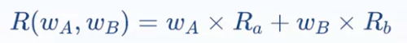
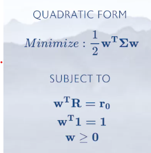

# Section 1-Introduction to Optimization and The Efficient Frontier
## 2자산 조합(2-Asset Combination)
### 이론 이해
#### Return
기대수익률이 A = 5%, B = 10%인 경우,  
A와 B를 50:50으로 조합한 포트폴리오의 기대수익률은 단순 Weighted Sum이다
즉, 7.5%이다

#### Risk
Std가 A = 10%, B = 14%인 경우,  
A와 B를 50:50으로 조합한 포트폴리오의 Std는 단순 Weighted Sum이 **아니다!**  
그 이유는, 포트폴리오의 Std의 구성요소에는 A와 B의 Correlation이라는 추가적인 요소가 포함되기 때문이다

#### 마코위츠 '곡선'이 직선이 아닌 이유
weight를 변화시켜가며 Return-Risk 평면에 그리면 곡선이 된다  
즉, A와 B를 조합하여 포트폴리오를 구성하면, **A보다도, B보다도 적은 Risk**를 **갖게 할 수 있다**

### 코드 실습
#### 순서
1. Return의 시계열 데이터를 구한다
2. 전체 기간을 In-Sample과 Out-Of-Sample로 나눈다
3. In-Sample로부터 연평균 Return을 구한다
4. In-Sample로부터 자산군 Covariance를 구한다

## 3자산 조합과 Efficient Frontier
### 이론
3자산을 사용하면, 3개의 자산을 이용해 마코위츠 곡선을 계속 확장시킬 수 있다.  
평면내 존재하는 사용가능한 모든 자산들을 이용한 '최선의 조합'이 가능하다  
이를 Efficient Frontier 라고 한다

### 그래프/수식적 접근
1. 최소/최대 Return의 범위를 정한다
2. 그 사이를 Grid로 나눈다
3. Optimizer를 이용해 각 Grid별 Minimum Volatility 를 찾는다

Quadratic Form으로 이루어진 수식을 최소화한다.

### 코드 실습 using Quadprog
1. 위에서 구한 In-Sample 연평균 Return/Covariance 사용

---

# Section 2-Implementing Markowitz
## Capital Market Line
Sharpe Ratio : 해당 포트폴리오의 Excess Risk 대비 Excess Return의 비율

### 코드 실습
0. 앞에서 배운 Efficient Frontier 시각화
1. 랜덤 포트폴리오 생성
2. 해당 포트폴리오의 Sharpe Ratio 계산
3. 조건에 맞게 maximize
4. 1~3에 의해 Maximize된 포트폴리오가 실제 Efficient Frontier의 접점과 일치하는지 확인

## 마코위츠 접근의 문제점
### 문제점
1. 사용되는 parameter들을 정확하게 측정할 수 있으며, 신뢰할 수 있는가?
2. 정확하지 않은 parameter를 사용할 경우, error maximizing machine으로 동작
### 마코위츠 접근을 개선하기 위한 방법
1. Expected Return, Volatility, Correlation을 정확하게 측정하고자 하는 노력
2. Expected Return을 구할 필요 없이 차라리 Global Minimum Vairance Portfolio를 택하자

### 